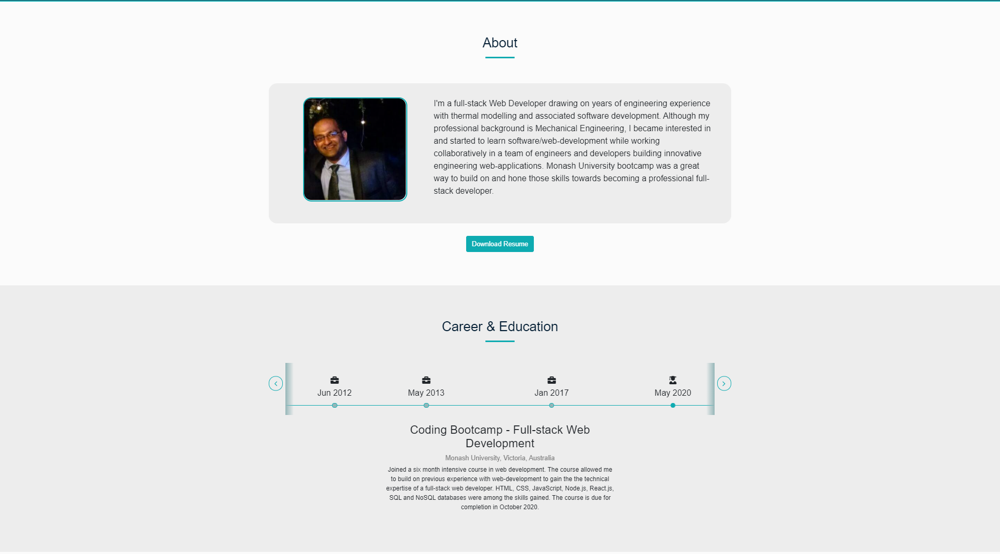

   
   
   
   
   
  

  # Welcome to my React.js portfolio

  ## Table of Contents

  * [Description](#Description)
  * [Application](#Application)
  * [Version](#Version)
  * [Questions](#Questions)

  ## Description

  My professional portfolio built using react.

  ## Application

  Access the deployed portfolio here: https://bdcoelho.github.io.

  #### Screenshot

  

  ## Version

  

  ## Questions

  Please get in touch through github or email if you have questions or wish to collaborate:

  https://github.com/bdcoelho 

  ben_coelho@hotmail.com
  
